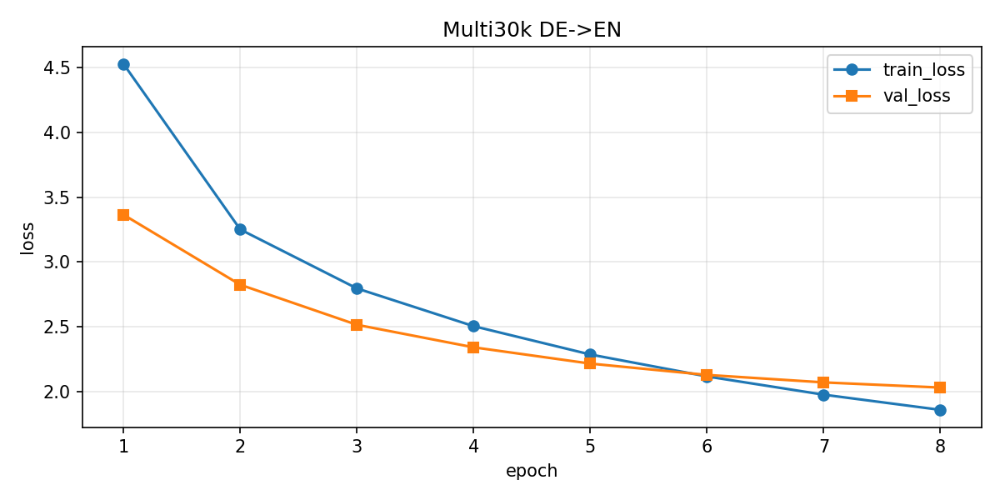
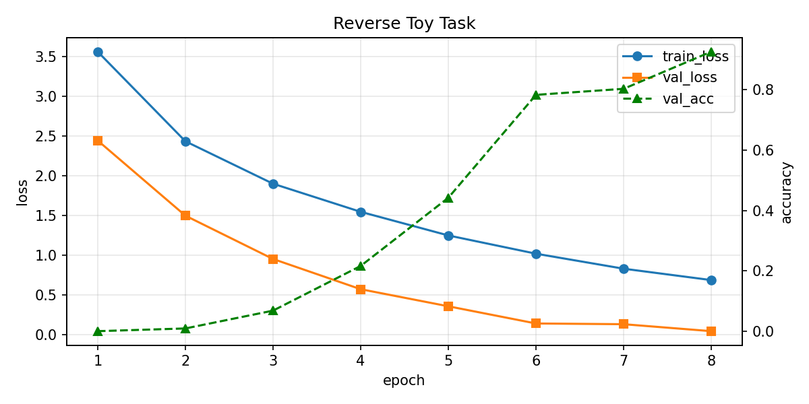

# Transformer 项目代码讲解报告

> **《深度学习》课程 Project** · 按作业 **4.3 代码讲解 12 条要求** 整理  
> 用途：答辩 PPT 讲稿 + 书面报告；代码块可直接粘贴到幻灯片作为「代码截图」

---

## 讲解提纲（建议 15–20 分钟）

| 顺序 | 对应条目 | 建议时长 |
|------|----------|----------|
| 1 | 目录结构 | 1 min |
| 2 | 各 `.py` 文件职责 | 2 min |
| 3 | 核心类/函数 | 3 min |
| 4–5 | 数据处理与张量维度 | 3 min |
| 6–8 | Q/K/V、多头注意力、编解码器堆叠 | 4 min |
| 9 | Mask | 2 min |
| 10–11 | 损失、优化器、训练流程 | 2 min |
| 12 | 结果保存与分析 | 2 min |

---

## 1. 代码项目的整体目录结构

```
transformer/
├── README.md                 # 项目使用说明
├── requirements.txt          # Python 依赖
├── transformer_project.pdf   # 课程作业说明
├── model.py                  # ★ Transformer 核心模型
├── train.py                  # ★ 训练入口
├── test.py                   # 测试 / BLEU 评测
├── inference.py              # 贪心解码推理
├── configs/                  # 超参数 YAML 配置
│   ├── default.yaml          # Multi30k 德→英（默认）
│   ├── quick.yaml            # 小语料快速实验
│   └── reverse.yaml          # 序列反转玩具任务
├── data/
│   ├── masks.py              # Padding / 因果掩码
│   ├── vocab.py              # 词表与 Tokenizer
│   ├── parallel_dataset.py   # 平行语料 Dataset
│   ├── reverse_dataset.py    # 反转任务 Dataset
│   ├── multi30k/             # 真实 Multi30k 语料
│   └── corpus/               # 合成示例语料
├── scripts/
│   ├── download_multi30k.py  # 下载 Multi30k
│   ├── build_sample_corpus.py
│   ├── plot_loss.py          # 绘制 loss 曲线
│   └── run_all.py            # 一键训练+评测
├── checkpoints/              # 模型权重 .pt
├── results/                  # 训练日志、BLEU、样例译文
├── figures/                  # 训练曲线图（PNG）
├── report/                   # 本讲解报告
├── PPT/                      # 答辩幻灯片（自行放入）
└── poster/                   # 海报（可选）
```

**讲解要点**：项目按「模型 / 数据 / 训练 / 评测 / 配置」分层；核心逻辑集中在 `model.py`、`train.py`、`data/` 三个位置。

---

## 2. 每个主要 `.py` 文件的作用

| 文件 | 作用 |
|------|------|
| **`model.py`** | 从零实现 Embedding、位置编码、缩放点积注意力、Multi-Head Attention、FFN、Encoder/Decoder 及 `build_model` 工厂函数 |
| **`train.py`** | 读取 YAML 配置 → 建词表与 DataLoader → 训练循环 → 保存 checkpoint 与 `train_log.csv` |
| **`test.py`** | 加载 checkpoint，在测试集上计算 **BLEU**（翻译）或**序列准确率**（反转任务） |
| **`inference.py`** | 推理阶段**贪心解码**，逐 token 自回归生成译文 |
| **`data/vocab.py`** | 词表构建、`encode`/`decode`、空格分词 Tokenizer |
| **`data/masks.py`** | `make_src_mask`（源 padding）、`make_tgt_mask`（目标 padding + 因果掩码） |
| **`data/parallel_dataset.py`** | Multi30k 行对齐语料的 `Dataset` 与 `collate_translation` |
| **`data/reverse_dataset.py`** | 随机序列反转玩具任务（快速验证注意力与掩码实现） |
| **`scripts/*.py`** | 数据下载、语料生成、loss 曲线绘制、全流程自动化 |

---

## 3. Transformer 模型中每个核心类或函数的功能

| 模块 | 类/函数 | 功能 |
|------|---------|------|
| 嵌入 | `Embeddings` | `nn.Embedding` 查表，输出乘以 √d_model 缩放 |
| 位置 | `PositionalEncoding` | 正弦/余弦位置编码 + dropout |
| 注意力 | `scaled_dot_product_attention` | softmax(QKᵀ/√d_k) · V，支持 mask |
| 注意力 | `MultiHeadAttention` | 4 个 Linear 投影 Q/K/V/输出，分头计算后拼接 |
| FFN | `PositionwiseFeedForward` | 两层全连接 + ReLU + Dropout |
| 残差 | `SublayerConnection` | Pre-LN：Norm → 子层 → Dropout → 残差相加 |
| 编码 | `EncoderLayer` / `Encoder` | 自注意力 + FFN，堆叠 N 层，末层 LayerNorm |
| 解码 | `DecoderLayer` / `Decoder` | 掩码自注意力 + 交叉注意力 + FFN |
| 输出 | `Generator` | Linear → log_softmax，输出词表 log 概率 |
| 整体 | `Transformer` | `encode` / `decode` / `forward` 三接口 |
| 工厂 | `build_model` | 按超参组装模型并 Xavier 初始化 |

### 代码截图 ①：缩放点积注意力

> 文件：`model.py` 第 28–58 行

```python
def scaled_dot_product_attention(
    query, key, value, mask=None, dropout=None,
):
  """缩放点积注意力（单头）。"""
  d_k = query.size(-1)
  scores = torch.matmul(query, key.transpose(-2, -1)) / math.sqrt(d_k)
  if mask is not None:
      scores = scores.masked_fill(mask == 0, float("-inf"))
  p_attn = F.softmax(scores, dim=-1)
  if dropout is not None:
      p_attn = dropout(p_attn)
  return torch.matmul(p_attn, value), p_attn
```

### 代码截图 ②：组装完整模型

> 文件：`model.py` 第 326–384 行

```python
def build_model(src_vocab, tgt_vocab, n_layers=3, d_model=128, ...):
    enc_layers, dec_layers = [], []
    for _ in range(n_layers):
        enc_layers.append(EncoderLayer(d_model, MultiHeadAttention(...), FFN(...), dropout))
        dec_layers.append(DecoderLayer(d_model, MultiHeadAttention(...), MultiHeadAttention(...), FFN(...), dropout))
    model = Transformer(
        Encoder(nn.ModuleList(enc_layers)),
        Decoder(nn.ModuleList(dec_layers)),
        nn.Sequential(Embeddings(src_vocab, d_model), PositionalEncoding(...)),
        nn.Sequential(Embeddings(tgt_vocab, d_model), PositionalEncoding(...)),
        Generator(d_model, tgt_vocab),
    )
    # Xavier 初始化
    return model
```

---

## 4. 输入数据如何被处理

**完整流程**：

```
原始文本 (.de / .en)
    ↓ whitespace_tokenizer 分词
token 列表
    ↓ Vocab.encode（未知词 → UNK）
token id 列表
    ↓ 加 BOS / EOS
    ↓ pad_2d 对齐 batch 长度
    ↓ tgt_in / tgt_out 错位（Teacher Forcing）
    ↓ make_src_mask / make_tgt_mask
送入 Transformer
```

**特殊符号**（`data/vocab.py`）：

| 符号 | id | 含义 |
|------|----|------|
| `<pad>` | 0 | 填充 |
| `<unk>` | 1 | 未知词 |
| `<bos>` | 2 | 句首 |
| `<eos>` | 3 | 句尾 |

### 代码截图 ③：单条样本构造

> 文件：`data/parallel_dataset.py` 第 65–77 行

```python
def __getitem__(self, idx):
    s = self.src_tokenizer(self.src_lines[idx])   # 德语分词
    t = self.tgt_tokenizer(self.tgt_lines[idx])   # 英语分词
    src_ids = self.src_vocab.encode(s, self.max_len - 2)
    tgt_ids = self.tgt_vocab.encode(t, self.max_len - 2)
    src_seq = [Vocab.BOS] + src_ids + [Vocab.EOS]
    tgt_seq = [Vocab.BOS] + tgt_ids + [Vocab.EOS]
    return src_seq, tgt_seq
```

### 代码截图 ④：Teacher Forcing 的 batch 组装

> 文件：`data/parallel_dataset.py` 第 94–108 行

```python
def collate_translation(batch, pad_idx=0):
    src_seqs, tgt_seqs = zip(*batch)
    src = pad_2d(list(src_seqs), pad_idx)
    tgt_full = pad_2d(list(tgt_seqs), pad_idx)
    tgt_in  = tgt_full[:, :-1]   # 解码器输入：去掉最后一个 token
    tgt_out = tgt_full[:,  1:]   # 预测目标：右移一位
    src_mask = make_src_mask(src, pad_idx)
    tgt_mask = make_tgt_mask(tgt_in, pad_idx)
    return TranslationBatch(src, tgt_in, tgt_out, src_mask, tgt_mask)
```

**Teacher Forcing 示意**（目标句 `"I am fine"`）：

```
完整序列:  [BOS]  I   am  fine  [EOS]
tgt_in:    [BOS]  I   am  fine          ← 解码器输入
tgt_out:         I   am  fine  [EOS]    ← 监督信号（预测下一词）
```

**数据规模（Multi30k）**：训练 29,000 句对；验证 1,014；测试 1,000。

---

## 5. 模型输入和输出的张量维度

**符号约定**：

| 符号 | 含义 | 默认值 |
|------|------|--------|
| B | batch_size | 64 |
| S | 源序列长度 | ≤ 128 |
| T | 目标序列长度 | ≤ 128 |
| d_model | 模型维度 | 256 |
| H | 注意力头数 | 8 |
| d_k | 每头维度 | d_model/H = 32 |
| V_src / V_tgt | 词表大小 | ≤ 8000 |

**各阶段张量形状**：

| 阶段 | 变量 | 形状 | 说明 |
|------|------|------|------|
| 输入 | `src` | `(B, S)` | 源语言 token id |
| 输入 | `tgt_in` | `(B, T)` | 解码器输入（teacher forcing） |
| 监督 | `tgt_out` | `(B, T)` | 预测目标（右移一位） |
| 掩码 | `src_mask` | `(B, 1, 1, S)` | 源 padding mask |
| 掩码 | `tgt_mask` | `(B, 1, T, T)` | padding ∧ 因果 mask |
| 嵌入后 | `src_embed` | `(B, S, d_model)` | 词嵌入 + 位置编码 |
| 编码器 | `memory` | `(B, S, d_model)` | Encoder 输出 |
| 解码器 | `dec_out` | `(B, T, d_model)` | Decoder 输出 |
| 输出 | `logits` | `(B, T, V_tgt)` | Generator 的 log_softmax |

### 代码截图 ⑤：超参数配置

> 文件：`configs/default.yaml`

```yaml
model:
  d_model: 256
  d_ff: 1024
  num_heads: 8
  num_layers: 3
  dropout: 0.1
  max_len: 128
train:
  batch_size: 64
  lr: 0.0003
  epochs: 20
  grad_clip: 1.0
```

---

## 6. Attention 模块中 Q、K、V 的含义和维度变化

### 6.1 含义

| 符号 | 含义 | 直觉 |
|------|------|------|
| **Q** (Query) | 「当前位置要查询什么」 | 对 `query` 输入做 Linear 投影 |
| **K** (Key) | 「被匹配的索引/标签」 | 对 `key` 输入做 Linear 投影 |
| **V** (Value) | 「实际取出的内容」 | 对 `value` 输入做 Linear 投影 |

**两种注意力模式**：

- **自注意力（Self-Attention）**：Q、K、V 来自同一序列（Encoder 自注意力、Decoder 第一层）
- **交叉注意力（Cross-Attention）**：Q 来自 Decoder，K/V 来自 Encoder 的 `memory`（Decoder 第二层）

### 6.2 维度变化

```
输入 query: (B, L, d_model)
    ↓ Linear(d_model, d_model)
    ↓ view + transpose
Q: (B, H, L, d_k)          其中 d_k = d_model / H = 32

scores = Q @ Kᵀ: (B, H, L_q, L_k)
attn @ V:       (B, H, L_q, d_k)
拼回:           (B, L_q, d_model)
    ↓ 输出 Linear
输出:           (B, L_q, d_model)
```

### 代码截图 ⑥：Q/K/V 投影与分头

> 文件：`model.py` 第 130–138 行

```python
def proj(x, i):
    # Linear → reshape → (B, H, seq, d_k)
    return self.linears[i](x).view(nbatches, -1, self.num_heads, self.d_k).transpose(1, 2)

q, k, v = proj(query, 0), proj(key, 1), proj(value, 2)
x, p_attn = scaled_dot_product_attention(q, k, v, mask, self.dropout)
x = x.transpose(1, 2).contiguous().view(nbatches, -1, self.num_heads * self.d_k)
return self.linears[-1](x)   # 输出投影
```

---

## 7. Multi-Head Attention 如何实现

**核心思想**：将 d_model 切成 H 个头，每个头在 d_k 维子空间内独立做注意力，再拼接，使模型能同时关注不同语义子空间（语法、语义、位置关系等）。

**实现步骤**：

```
1. 4 个 nn.Linear(d_model, d_model)：分别投影 Q、K、V 与输出
2. view + transpose → (B, H, L, d_k)
3. 对每个头调用 scaled_dot_product_attention
4. transpose + view → (B, L, d_model)
5. 最后一个 Linear 混合多头信息
```

**示意图**：

```
输入 x (B, L, d_model)
    ├─ Linear → Q ─┐
    ├─ Linear → K ─┼─→ 分 H 头 → 各自 Scaled Dot-Product Attention
    └─ Linear → V ─┘
                        ↓ 拼接
                   (B, L, d_model)
                        ↓ 输出 Linear
                   (B, L, d_model)
```

**参数量**：每层注意力约 4 × d_model²（4 个 Linear 各 d_model×d_model）。

---

## 8. Encoder 和 Decoder 如何堆叠

### 8.1 整体数据流

```
源序列 ──→ [源嵌入 + 位置编码] ──→ Encoder × N ──→ memory
                                                      │
目标序列 ──→ [目标嵌入 + 位置编码] ──→ Decoder × N ←──┘
                                          │
                                     Generator → 词表概率
```

### 8.2 EncoderLayer 结构

```
输入 x
  → [LayerNorm → Multi-Head Self-Attention → Dropout] + 残差
  → [LayerNorm → Position-wise FFN → Dropout] + 残差
  → 输出
```

### 8.3 DecoderLayer 结构（三层子层）

```
输入 x
  → [LayerNorm → Masked Self-Attention → Dropout] + 残差   ← 不能看未来
  → [LayerNorm → Cross-Attention(Q=x, K/V=memory) → Dropout] + 残差
  → [LayerNorm → FFN → Dropout] + 残差
  → 输出
```

### 代码截图 ⑦：Decoder 三层子结构

> 文件：`model.py` 第 230–240 行

```python
def forward(self, x, memory, src_mask, tgt_mask):
    # 1. 掩码自注意力（Q=K=V=x，因果 mask）
    x = self.sublayer[0](x, lambda x_: self.self_attn(x_, x_, x_, tgt_mask))
    # 2. 交叉注意力（Q=x, K=V=memory，源 padding mask）
    x = self.sublayer[1](x, lambda x_: self.src_attn(x_, memory, memory, src_mask))
    # 3. 前馈网络
    return self.sublayer[2](x, self.feed_forward)
```

### 代码截图 ⑧：训练时 encode + decode

> 文件：`model.py` 第 301–311 行

```python
def encode(self, src, src_mask):
    return self.encoder(self.src_embed(src), src_mask)

def decode(self, memory, tgt, src_mask, tgt_mask):
    return self.decoder(self.tgt_embed(tgt), memory, src_mask, tgt_mask)

def forward(self, src, tgt, src_mask, tgt_mask):
    return self.decode(self.encode(src, src_mask), tgt, src_mask, tgt_mask)
```

默认 **`num_layers: 3`**：编码器 3 层 + 解码器 3 层，每层参数独立。

---

## 9. Mask 的作用

| 掩码类型 | 函数 | 作用 | 使用位置 |
|----------|------|------|----------|
| **Padding mask** | `make_src_mask` | 忽略 PAD token，防止注意力看到无效位置 | Encoder 自注意力、Decoder 交叉注意力 |
| **Padding mask（目标）** | `make_tgt_mask` 的一部分 | 忽略目标侧 PAD | Decoder 自注意力 |
| **Causal mask** | `subsequent_mask` | 解码器不能看到「未来」token，保证自回归 | Decoder 自注意力 |

**实现原理**：掩码为 `False`（或 0）的位置，在 softmax 前将 attention score 设为 `-inf`，softmax 后权重为 0。

### 代码截图 ⑨：源序列与目标序列掩码

> 文件：`data/masks.py` 第 19–38 行

```python
def make_src_mask(src, pad_idx=0):
    # (B, 1, 1, S) — True 表示非 padding
    return (src != pad_idx).unsqueeze(1).unsqueeze(2)

def make_tgt_mask(tgt, pad_idx=0):
    pad_keys = (tgt != pad_idx).unsqueeze(1).unsqueeze(2)   # (B, 1, 1, T)
    causal   = subsequent_mask(tgt.size(1), tgt.device).unsqueeze(0)  # (1, 1, T, T)
    return pad_keys & causal   # (B, 1, T, T)
```

**因果掩码示意（T=4）**：

```
         k0   k1   k2   k3
  q0      ✓    ✗    ✗    ✗     ← 位置 0 只能看自己
  q1      ✓    ✓    ✗    ✗     ← 位置 1 能看 0、1
  q2      ✓    ✓    ✓    ✗
  q3      ✓    ✓    ✓    ✓     ← 位置 3 能看全部
```

---

## 10. Loss function 和 optimizer 的设置

| 项目 | 选择 | 说明 |
|------|------|------|
| **损失函数** | `nn.NLLLoss(ignore_index=0)` | 与 `Generator` 的 `log_softmax` 配对，等价于 CrossEntropy |
| **优化器** | `Adam(lr=3e-4, betas=(0.9, 0.98), eps=1e-9)` | 与 Transformer 原论文一致 |
| **梯度裁剪** | `clip_grad_norm_(max_norm=1.0)` | 防止梯度爆炸 |
| **忽略项** | `PAD id=0` | padding 位置不参与 loss 计算 |

### 代码截图 ⑩：单步损失计算

> 文件：`train.py` 第 56–60 行

```python
def run_step_nll(model, criterion, batch):
    out = model(batch.src, batch.tgt_in, batch.src_mask, batch.tgt_mask)
    logits = model.generator(out)                              # (B, T, V_tgt)
    return criterion(
        logits.reshape(-1, logits.size(-1)),                   # (B*T, V_tgt)
        batch.tgt_out.reshape(-1),                               # (B*T,)
    )
```

### 代码截图 ⑪：优化器与损失初始化

> 文件：`train.py` 第 125–126 行

```python
opt  = Adam(model.parameters(), lr=float(tr["lr"]), betas=(0.9, 0.98), eps=1e-9)
crit = nn.NLLLoss(ignore_index=Vocab.PAD)
```

---

## 11. 训练过程如何执行

### 11.1 训练流程

```
读取 configs/default.yaml
    ↓
构建词表（源/目标各一个）+ DataLoader
    ↓
build_model() + 打印参数量
    ↓
┌─ 每个 epoch ─────────────────────────────────┐
│  遍历 train_loader                            │
│    → forward + NLLLoss + backward             │
│    → clip_grad_norm_ + optimizer.step()       │
│  遍历 val_loader → 计算 val_loss              │
│  若 val_loss 更优 → 保存 best_translation.pt  │
│  写入 train_log.csv                           │
└───────────────────────────────────────────────┘
```

### 11.2 运行命令

```bash
# 安装依赖
pip install -r requirements.txt

# 下载 Multi30k 语料
python scripts/download_multi30k.py

# 开始训练
python train.py --config configs/default.yaml

# 可选：指定 GPU
python train.py --config configs/default.yaml --device cuda
```

### 11.3 参数量（作业要求）

> 文件：`train.py` 第 38–43 行

```python
def print_param_count(model):
    total     = sum(p.numel() for p in model.parameters())
    trainable = sum(p.numel() for p in model.parameters() if p.requires_grad)
    print("Total parameters:", total)
    print("Trainable parameters:", trainable)
```

**Local verified value** (`checkpoints/best_translation.pt`, Multi30k default config): Total parameters = **11,664,156**. This checkpoint uses `d_model=256`, 3 Encoder layers, 3 Decoder layers, source vocabulary 8000, and target vocabulary 7964.

### 代码截图 ⑫：训练循环核心

> 文件：`train.py` 第 136–168 行

```python
for epoch in range(1, epochs + 1):
    model.train()
    for batch in train_loader:
        batch = batch.to(device)          # 各字段搬到 GPU/CPU
        opt.zero_grad(set_to_none=True)
        loss = run_step_nll(model, crit, batch)
        loss.backward()
        torch.nn.utils.clip_grad_norm_(model.parameters(), max_norm=clip)
        opt.step()

    model.eval()
    for vb in val_loader:
        vlosses.append(run_step_nll(model, crit, vb).item())
    val_loss = sum(vlosses) / len(vlosses)

    if val_loss < best:
        torch.save(ckpt, ckpt_dir / "best_translation.pt")
```

---

## 12. 训练结果如何保存和分析

### 12.1 保存内容一览

| 路径 | 内容 |
|------|------|
| `checkpoints/best_translation.pt` | 最优模型 `state_dict` + 配置 + 词表 |
| `results/translation/train_log.csv` | 每 epoch 的 train_loss / val_loss / 耗时 |
| `results/translation/best_val_loss.json` | 最优验证 loss 与对应 epoch |
| `results/translation/test_bleu.json` | 测试集 corpus BLEU 分数 |
| `results/translation/predictions_sample.txt` | 前 50 条 REF/HYP 对照样例 |
| `figures/translation_loss.png` | 训练/验证 loss 曲线图 |

### 12.2 训练曲线



*图 1：Multi30k 德→英 8 epoch 训练曲线（CPU）*

| epoch | train_loss | val_loss | 耗时(s) |
|-------|------------|----------|---------|
| 1 | 4.5257 | 3.3645 | 253.7 |
| 4 | 2.5063 | 2.3433 | 272.7 |
| 8 | 1.8617 | 2.0334 | 252.8 |

**观察**：train_loss 持续下降；val_loss 在第 8 epoch 后趋于平稳（2.03），存在轻微过拟合趋势。

### 12.3 测试集 BLEU

```json
{
  "score": 76.52,
  "precisions": [100.0, 85.71, 66.67, 60.0],
  "bp": 1.0
}
```

*来源：`results/translation/test_bleu.json`（8 epoch，CPU 训练）*

### 12.4 译文样例

```
REF: Zwei junge weiße Männer sind im Freien ...
HYP: two young white men are outside ...

REF: Der Hund lacht und ist jung .
HYP: the dog laughs and is young .
```

完整 50 条样例见 `results/translation/predictions_sample.txt`。

### 12.5 评测命令

```bash
python test.py --checkpoint checkpoints/best_translation.pt \
  --output-json results/translation/test_bleu.json
```

### 代码截图 ⑬：贪心解码（推理）

> 文件：`inference.py` 第 33–44 行

```python
@torch.no_grad()
def greedy_decode(model, src, pad_idx, bos_idx, eos_idx, max_len):
    src_mask = make_src_mask(src, pad_idx)
    memory   = model.encode(src, src_mask)
    ys = torch.full((src.size(0), 1), bos_idx, ...)   # 从 BOS 开始
    for _ in range(max_len - 1):
        tgt_mask = make_tgt_mask(ys, pad_idx)
        out  = model.decode(memory, ys, src_mask, tgt_mask)
        nxt  = model.generator(out[:, -1]).argmax(dim=-1, keepdim=True)
        ys   = torch.cat([ys, nxt], dim=1)
        if (nxt.squeeze(-1) == eos_idx).all():
            break
    return ys
```

### 12.6 辅助任务结果（可选提及）

| 任务 | 指标 | 结果文件 |
|------|------|----------|
| 序列反转 | val_acc ≈ **92.6%**（第 8 epoch） | `results/reverse/test_metrics.json` |
| 合成语料 quick | BLEU 100 | `results/corpus_quick/test_bleu.json` |



*图 2：序列反转玩具任务 loss + accuracy 曲线*

### 12.7 绘制 loss 曲线

```bash
python scripts/plot_loss.py \
  --csv results/translation/train_log.csv \
  --out figures/translation_loss.png \
  --title "Multi30k DE->EN"
```

---

## 附录 A：PPT 每页建议配图清单

| 页码 | 标题 | 建议放入 |
|------|------|----------|
| 1 | 题目与分工 | 课程名、组号、成员 |
| 2 | 目录结构 | 本文第 1 节树状图 |
| 3 | 文件职责 | 第 2 节表格 |
| 4 | 模型总览 | 第 8 节数据流图 |
| 5 | 注意力机制 | 第 6 节 + 代码截图 ⑥ |
| 6 | 多头注意力 | 第 7 节示意图 |
| 7 | 数据处理 | 第 4 节流程 + 代码截图 ③④ |
| 8 | 张量维度 | 第 5 节表格 |
| 9 | Mask | 第 9 节矩阵示意 + 代码截图 ⑨ |
| 10 | 训练配置 | 第 10 节 + `default.yaml` 截图 |
| 11 | 训练流程 | 第 11 节流程图 + 代码截图 ⑫ |
| 12 | 实验结果 | 图 1 + BLEU 表 + 样例译文 |
| 13 | 总结 | 实现亮点、不足、展望 |

---

## 附录 B：从 IDE 导出代码截图

1. 在 Cursor / VS Code 中打开对应文件（如 `model.py`）。
2. 跳转到上文「代码截图」标注的行号（Ctrl+G）。
3. 选中函数或类 → 截图，或使用 **Copy as PNG** 插件。
4. 插入 PPT，建议统一字体与主题色。

> 也可直接将本文 **代码块** 粘贴到 PPT「代码」版式中，效果与截图等价。

---

## 附录 C：一键复现实验

```bash
pip install -r requirements.txt
python scripts/download_multi30k.py
python train.py --config configs/default.yaml
python test.py --checkpoint checkpoints/best_translation.pt
python scripts/plot_loss.py --csv results/translation/train_log.csv \
  --out figures/translation_loss.png --title "Multi30k DE->EN"
```

或一键全流程：

```bash
python scripts/run_all.py
```

---

*文档版本：与当前仓库代码一致 · 路径均为相对项目根目录*
