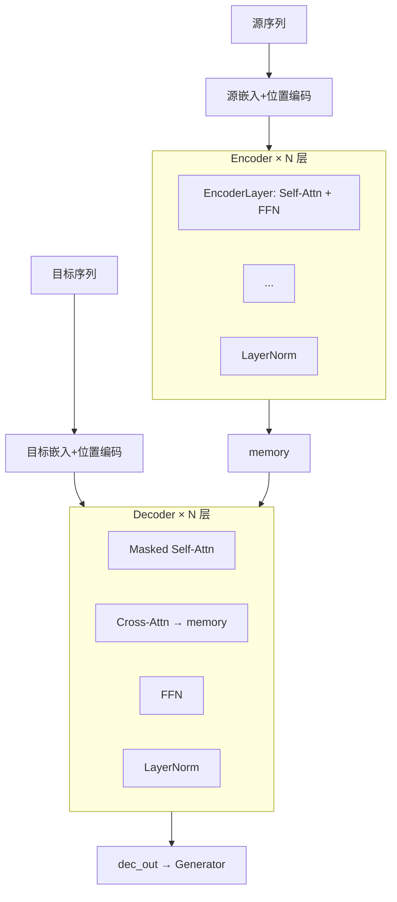
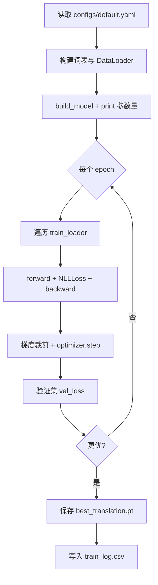

# Transformer 项目代码讲解稿

> **《深度学习》课程 Project** · 对应 PDF **4.3 代码讲解要求**（12 条）  
> 用途：答辩 PPT 讲稿 + 书面报告，可直接复制代码块到幻灯片作为「截图」。

---

## 讲解提纲（建议 15–20 分钟）

| 顺序 | 对应条目 | 建议时长 |
|------|----------|----------|
| 1 | 目录结构 | 1 min |
| 2 | 各 `.py` 文件职责 | 2 min |
| 3 | 核心类/函数 | 3 min |
| 4–5 | 数据处理与张量维度 | 3 min |
| 6–8 | Q/K/V、多头注意力、编解码器堆叠 | 4 min |
| 9 | Mask | 2 min |
| 10–11 | 损失、优化器、训练流程 | 2 min |
| 12 | 结果保存与分析 | 2 min |

---

## 1. 代码项目的整体目录结构

```
transformer/
├── README.md                 # 使用说明
├── requirements.txt          # 依赖
├── transformer_project.pdf   # 作业说明
├── model.py                  # Transformer 核心模型
├── train.py                  # 训练入口
├── test.py                   # 测试 / BLEU 评测
├── inference.py              # 贪心解码
├── configs/                  # 超参数 YAML
│   ├── default.yaml          # Multi30k 德→英
│   ├── quick.yaml            # 小语料快速实验
│   └── reverse.yaml          # 序列反转玩具任务
├── data/
│   ├── masks.py              # Padding / 因果掩码
│   ├── vocab.py              # 词表与 Tokenizer
│   ├── parallel_dataset.py   # 平行语料 Dataset
│   ├── reverse_dataset.py    # 反转任务 Dataset
│   ├── multi30k/             # 真实 Multi30k（train/val/test .de/.en）
│   └── corpus/               # 合成示例语料
├── scripts/
│   ├── download_multi30k.py  # 下载语料
│   ├── build_sample_corpus.py
│   ├── plot_loss.py          # 绘制 loss 曲线
│   └── run_all.py            # 一键训练+评测
├── checkpoints/              # 模型权重 .pt
├── results/                  # 日志、BLEU、样例译文
├── figures/                  # 训练曲线图
├── report/                   # 本讲解文档
├── PPT/                      # 答辩幻灯片（自行放入）
└── poster/                   # 海报（可选）
```

**幻灯片建议**：用一张树状图展示上述结构，并高亮 `model.py` / `train.py` / `data/`。

---

## 2. 每个主要 `.py` 文件的作用

| 文件 | 作用 |
|------|------|
| `model.py` | 实现 Embedding、位置编码、注意力、FFN、Encoder/Decoder 及 `build_model` |
| `train.py` | 读配置、建 DataLoader、训练循环、保存 checkpoint 与 `train_log.csv` |
| `test.py` | 加载 checkpoint，在测试集上算 **BLEU**（翻译）或**准确率**（反转） |
| `inference.py` | 推理阶段**贪心解码**，逐 token 生成译文 |
| `data/vocab.py` | 词表构建、`encode`/`decode`、空格分词 |
| `data/masks.py` | `make_src_mask`、`make_tgt_mask`（padding + causal） |
| `data/parallel_dataset.py` | Multi30k 行对齐语料的 `Dataset` 与 `collate` |
| `data/reverse_dataset.py` | 随机序列反转任务（验证实现正确性） |
| `scripts/*.py` | 数据下载、语料生成、画图、全流程脚本 |

---

## 3. Transformer 模型中每个核心类或函数的功能

| 模块 | 类/函数 | 功能 |
|------|---------|------|
| 嵌入 | `Embeddings` | `nn.Embedding` + ×√d_model |
| 位置 | `PositionalEncoding` | 正弦/余弦位置编码 + dropout |
| 注意力 | `scaled_dot_product_attention` | softmax(QK^T/√d_k)·V |
| 注意力 | `MultiHeadAttention` | 4 个 Linear，分头计算注意力后拼接 |
| FFN | `PositionwiseFeedForward` | 两层全连接 + ReLU |
| 残差 | `SublayerConnection` | Pre-LN：Norm → 子层 → Dropout → 残差 |
| 编码 | `EncoderLayer` / `Encoder` | 自注意力 + FFN，堆叠 N 层 |
| 解码 | `DecoderLayer` / `Decoder` | 掩码自注意力 + 交叉注意力 + FFN |
| 输出 | `Generator` | Linear + `log_softmax` → 词表 log 概率 |
| 整体 | `Transformer` | `encode` / `decode` / `forward` |
| 工厂 | `build_model` | 按超参组装并 Xavier 初始化 |

### 代码截图 ①：缩放点积注意力

```28:58:model.py
def scaled_dot_product_attention(
    query: torch.Tensor,
    key: torch.Tensor,
    value: torch.Tensor,
    mask: Optional[torch.Tensor] = None,
    dropout: Optional[nn.Dropout] = None,
) -> tuple[torch.Tensor, torch.Tensor]:
    """
    缩放点积注意力（单头）。
    ...
    """
    d_k = query.size(-1)
    scores = torch.matmul(query, key.transpose(-2, -1)) / math.sqrt(d_k)
    if mask is not None:
        scores = scores.masked_fill(mask == 0, float("-inf"))
    p_attn = F.softmax(scores, dim=-1)
    ...
    return torch.matmul(p_attn, value), p_attn
```

### 代码截图 ②：组装完整模型

```326:384:model.py
def build_model(
    src_vocab: int,
    tgt_vocab: int,
    n_layers: int = 3,
    d_model: int = 128,
    ...
) -> Transformer:
    ...
    model = Transformer(
        Encoder(nn.ModuleList(enc_layers)),
        Decoder(nn.ModuleList(dec_layers)),
        nn.Sequential(Embeddings(src_vocab, d_model), src_pe),
        nn.Sequential(Embeddings(tgt_vocab, d_model), tgt_pe),
        Generator(d_model, tgt_vocab),
    )
    ...
    return model
```

---

## 4. 输入数据如何被处理

**流程**：原始文本 → 分词 → 词表 id → 加 BOS/EOS → padding → 构造 mask → 送入模型。


**特殊符号**（`data/vocab.py`）：`PAD=0, UNK=1, BOS=2, EOS=3`。

### 代码截图 ③：单条样本构造

```65:77:data/parallel_dataset.py
    def __getitem__(self, idx: int) -> tuple[list[int], list[int]]:
        s = self.src_tokenizer(self.src_lines[idx])
        t = self.tgt_tokenizer(self.tgt_lines[idx])
        src_ids = self.src_vocab.encode(s, self.max_len - 2)
        tgt_ids = self.tgt_vocab.encode(t, self.max_len - 2)
        src_seq = [Vocab.BOS] + src_ids + [Vocab.EOS]
        tgt_seq = [Vocab.BOS] + tgt_ids + [Vocab.EOS]
        return src_seq, tgt_seq
```

### 代码截图 ④：Teacher Forcing 的 batch 组装

```94:108:data/parallel_dataset.py
def collate_translation(batch, pad_idx: int = 0) -> TranslationBatch:
    ...
    tgt_in = tgt_full[:, :-1].contiguous()
    tgt_out = tgt_full[:, 1:].contiguous()
    src_mask = make_src_mask(src, pad_idx)
    tgt_mask = make_tgt_mask(tgt_in, pad_idx)
    return TranslationBatch(...)
```

**数据规模（Multi30k）**：训练 29,000 句对；验证 1,014；测试 1,000。

---

## 5. 模型输入和输出的张量维度

设：`B`=batch_size，`S`=源序列长度，`T`=目标序列长度，`V_src`/`V_tgt`=词表大小，`d_model`=256（默认配置），`H`=8 头，`d_k`=d_model/H=32。

| 阶段 | 变量 | 形状 | 说明 |
|------|------|------|------|
| 输入 | `src` | `(B, S)` | 源语言 token id |
| 输入 | `tgt_in` | `(B, T)` | 解码器输入（teacher forcing） |
| 监督 | `tgt_out` | `(B, T)` | 预测目标（右移一位） |
| 掩码 | `src_mask` | `(B, 1, 1, S)` | 源 padding mask |
| 掩码 | `tgt_mask` | `(B, 1, T, T)` | padding ∧ 因果 mask |
| 嵌入后 | `src_embed` | `(B, S, d_model)` | 含位置编码 |
| 编码器 | `memory` | `(B, S, d_model)` | Encoder 输出 |
| 解码器 | `dec_out` | `(B, T, d_model)` | Decoder 输出 |
| 输出 | `logits` | `(B, T, V_tgt)` | Generator 的 log_softmax |

**配置来源**（`configs/default.yaml`）：

```yaml
model:
  d_model: 256
  d_ff: 1024
  num_heads: 8
  num_layers: 3
  max_len: 128
train:
  batch_size: 64
```

---

## 6. Attention 模块中 Q、K、V 的含义和维度变化

| 符号 | 含义 | 来源 |
|------|------|------|
| **Q** (Query) | 「当前要查询什么」 | 对 `query` 输入做 `Linear` |
| **K** (Key) | 「被匹配的索引」 | 对 `key` 输入做 `Linear` |
| **V** (Value) | 「实际取出的内容」 | 对 `value` 输入做 `Linear` |

**维度变化**（以 `MultiHeadAttention.forward` 为例）：

1. 输入 `query`: `(B, L, d_model)`
2. 线性投影后 reshape: `(B, H, L, d_k)`，其中 `d_k = d_model / H`
3. `scores = Q @ K^T`: `(B, H, L_q, L_k)`
4. `attn @ V`: `(B, H, L_q, d_k)`
5. 拼回: `(B, L_q, d_model)`，再经输出 Linear

**自注意力**：Q、K、V 来自同一序列。  
**交叉注意力（Decoder 第二层）**：Q 来自解码器，K/V 来自 `memory`（编码器输出）。

### 代码截图 ⑤：Q/K/V 投影与分头

```130:138:model.py
        def proj(x: torch.Tensor, i: int) -> torch.Tensor:
            return self.linears[i](x).view(nbatches, -1, self.num_heads, self.d_k).transpose(1, 2)

        q, k, v = proj(query, 0), proj(key, 1), proj(value, 2)
        x, p_attn = scaled_dot_product_attention(q, k, v, mask, self.dropout)
        ...
        return self.linears[-1](x)
```

---

## 7. Multi-Head Attention 如何实现

**思想**：把 `d_model` 切成 `H` 个头，每头在 `d_k` 维子空间内独立做注意力，再拼接，使模型关注不同语义子空间。

**实现步骤**：

1. 4 个 `nn.Linear(d_model, d_model)`：分别投影 Q、K、V 与输出
2. `view` + `transpose` → `(B, H, L, d_k)`
3. 对每个头调用 `scaled_dot_product_attention`
4. `transpose` + `view` → `(B, L, d_model)`
5. 最后一个 Linear 混合多头信息

**参数量**：每层注意力 4×(d_model²) + 输出投影，Encoder/Decoder 各有多处调用。

---

## 8. Encoder 和 Decoder 如何堆叠



### 代码截图 ⑥：Decoder 三层子结构

```230:240:model.py
    def forward(self, x, memory, src_mask, tgt_mask):
        x = self.sublayer[0](x, lambda x_: self.self_attn(x_, x_, x_, tgt_mask))
        x = self.sublayer[1](x, lambda x_: self.src_attn(x_, memory, memory, src_mask))
        return self.sublayer[2](x, self.feed_forward)
```

### 代码截图 ⑦：训练时 encode + decode

```301:311:model.py
    def encode(self, src, src_mask):
        return self.encoder(self.src_embed(src), src_mask)

    def decode(self, memory, tgt, src_mask, tgt_mask):
        return self.decoder(self.tgt_embed(tgt), memory, src_mask, tgt_mask)

    def forward(self, src, tgt, src_mask, tgt_mask):
        return self.decode(self.encode(src, src_mask), tgt, src_mask, tgt_mask)
```

默认 **`num_layers: 3`**：编码器 3 层、解码器 3 层，每层结构相同但参数独立。

---

## 9. Mask 的作用

| 掩码 | 函数 | 作用 |
|------|------|------|
| **Padding mask** | `make_src_mask` | 忽略 PAD，防止注意力看到无效位置 |
| **Padding mask（目标）** | `make_tgt_mask` 的一部分 | 忽略目标侧 PAD |
| **Causal mask** | `subsequent_mask` | 解码器不能看到「未来」token，保证自回归 |

**实现**：掩码为 `False` 的位置在 softmax 前将 score 设为 `-inf`。

### 代码截图 ⑧：源序列与目标序列掩码

```19:38:data/masks.py
def make_src_mask(src: torch.Tensor, pad_idx: int = 0) -> torch.Tensor:
    return (src != pad_idx).unsqueeze(1).unsqueeze(2)

def make_tgt_mask(tgt: torch.Tensor, pad_idx: int = 0) -> torch.Tensor:
    pad_keys = (tgt != pad_idx).unsqueeze(1).unsqueeze(2)
    causal = subsequent_mask(tgt.size(1), tgt.device).unsqueeze(0)
    return pad_keys & causal
```

**示意图（因果掩码，T=4）**：

```
      k0  k1  k2  k3
  q0   ✓   ✗   ✗   ✗
  q1   ✓   ✓   ✗   ✗
  q2   ✓   ✓   ✓   ✗
  q3   ✓   ✓   ✓   ✓
```

---

## 10. Loss function 和 optimizer 的设置

| 项目 | 选择 | 说明 |
|------|------|------|
| **损失** | `nn.NLLLoss(ignore_index=0)` | 与 `Generator` 的 `log_softmax` 配对 |
| **优化器** | `Adam(lr=3e-4, betas=(0.9, 0.98), eps=1e-9)` | 与论文/常见实现一致 |
| **正则** | `grad_clip=1.0` | `clip_grad_norm_` 防止梯度爆炸 |
| **忽略** | `PAD` id=0 | padding 位置不参与 loss |

### 代码截图 ⑨：单步损失计算

```56:60:train.py
def run_step_nll(model, criterion, batch) -> torch.Tensor:
    out = model(batch.src, batch.tgt_in, batch.src_mask, batch.tgt_mask)
    logits = model.generator(out)
    return criterion(logits.reshape(-1, logits.size(-1)), batch.tgt_out.reshape(-1))
```

```125:126:train.py
    opt = Adam(model.parameters(), lr=float(tr["lr"]), betas=(0.9, 0.98), eps=1e-9)
    crit = nn.NLLLoss(ignore_index=Vocab.PAD)
```

---

## 11. 训练过程如何执行



**命令**（在项目根目录）：

```bash
python train.py --config configs/default.yaml
```

**参数量打印**（作业要求）：

```36:40:train.py
def print_param_count(model: nn.Module) -> None:
    total = sum(p.numel() for p in model.parameters())
    trainable = sum(p.numel() for p in model.parameters() if p.requires_grad)
    print("Total parameters:", total)
    print("Trainable parameters:", trainable)
```

Local verified value (`checkpoints/best_translation.pt`, Multi30k config): Total parameters = **11,664,156**. This checkpoint uses `d_model=256`, 3 Encoder layers, 3 Decoder layers, source vocabulary 8000, and target vocabulary 7964.

### 代码截图 ⑩：训练循环核心

```136:168:train.py
    for epoch in range(1, epochs + 1):
        model.train()
        ...
        for batch in train_loader:
            ...
            loss = run_step_nll(model, crit, batch)
            loss.backward()
            torch.nn.utils.clip_grad_norm_(model.parameters(), max_norm=clip)
            opt.step()
        ...
        for vb in val_loader:
            vlosses.append(run_step_nll(model, crit, vb).item())
        ...
        if val_loss < best:
            torch.save(ckpt, ckpt_dir / ck_name)
```

---

## 12. 训练结果如何保存和分析

### 12.1 保存内容

| 路径 | 内容 |
|------|------|
| `checkpoints/best_translation.pt` | `state_dict` + 配置 + 词表 |
| `results/translation/train_log.csv` | 每 epoch 的 train/val loss |
| `results/translation/best_val_loss.json` | 最优验证 loss 与 epoch |
| `results/translation/test_bleu.json` | 测试集 BLEU |
| `results/translation/predictions_sample.txt` | 前 50 条 REF/HYP 对照 |
| `figures/translation_loss.png` | loss 曲线图 |

### 12.2 训练曲线（截图）


*图 1：`figures/translation_loss.png`（8 epoch 本地训练）*

| epoch | train_loss | val_loss |
|-------|------------|----------|
| 1 | 4.5257 | 3.3645 |
| 4 | 2.5063 | 2.3433 |
| 8 | 1.8617 | 2.0334 |

### 12.3 测试集 BLEU

```json
{
  "score": 76.52,
  "precisions": [100.0, 85.71, 66.67, 60.0],
  "bp": 1.0
}
```

*来源：`results/translation/test_bleu.json`（8 epoch，CPU）*

### 12.4 译文样例（截图）

```
REF: Zwei junge weiße Männer sind im Freien ...
HYP: two young white men are outside ...
```

完整样例见 `results/translation/predictions_sample.txt`。

### 12.5 评测命令

```bash
python test.py --checkpoint checkpoints/best_translation.pt \
  --output-json results/translation/test_bleu.json
```

### 代码截图 ⑪：贪心解码（推理）

```33:44:inference.py
    memory = model.encode(src, src_mask)
    ys = torch.full((src.size(0), 1), bos_id, dtype=torch.long, device=device)
    for _ in range(max_len - 1):
        tgt_mask = make_tgt_mask(ys, pad_idx)
        out = model.decode(memory, ys, src_mask, tgt_mask)
        nxt = model.generator(out[:, -1]).argmax(dim=-1, keepdim=True)
        ys = torch.cat([ys, nxt], dim=1)
        ...
    return ys
```

### 12.6 辅助任务（可选提及）

| 任务 | 指标 | 结果文件 |
|------|------|----------|
| 序列反转 | val_acc ≈ 92.6% | `results/reverse/test_metrics.json` |
| 合成语料 quick | BLEU 100 | `results/corpus_quick/test_bleu.json` |


---

## 附录 A：PPT 每页建议配图清单

| 页码 | 标题 | 建议放入 |
|------|------|----------|
| 1 | 题目与分工 | 课程名、组号 |
| 2 | 目录结构 | 本文第 1 节树状图 |
| 3 | 文件职责 | 第 2 节表格 |
| 4 | 模型总览 | 第 8 节 mermaid 图 |
| 5 | 注意力公式 | 第 6 节 + 代码截图 ⑤ |
| 6 | 多头注意力 | 第 7 节 |
| 7 | 数据处理 | 第 4 节流程图 + 代码截图 ③④ |
| 8 | 张量维度 | 第 5 节表格 |
| 9 | Mask | 第 9 节矩阵示意 + 代码截图 ⑧ |
| 10 | 训练配置 | 第 10 节 + `default.yaml` 截图 |
| 11 | 训练流程 | 第 11 节流程图 |
| 12 | 结果 | 图 1 + BLEU 表 + 样例译文 |
| 13 | 总结 | 创新点、不足、展望 |

---

## 附录 B：从 IDE 导出代码截图的步骤

1. 在 VS Code / Cursor 中打开对应文件（如 `model.py`）。
2. 跳转到上文「代码截图」标注的行号。
3. 选中函数或类 → 截图或使用 **Copy as PNG** 插件。
4. 插入 PPT，建议统一字体与深色/浅色主题。

也可直接将本文中的 **代码块** 粘贴到 PPT「代码」版式中，效果与截图等价。

---

## 附录 C：一键复现实验

```bash
pip install -r requirements.txt
python scripts/download_multi30k.py
python train.py --config configs/default.yaml
python test.py --checkpoint checkpoints/best_translation.pt
python scripts/plot_loss.py --csv results/translation/train_log.csv \
  --out figures/translation_loss.png --title "Multi30k DE->EN"
```

或：

```bash
python scripts/run_all.py
```

---

*文档版本：与当前仓库代码一致 · 路径均为相对项目根目录*
